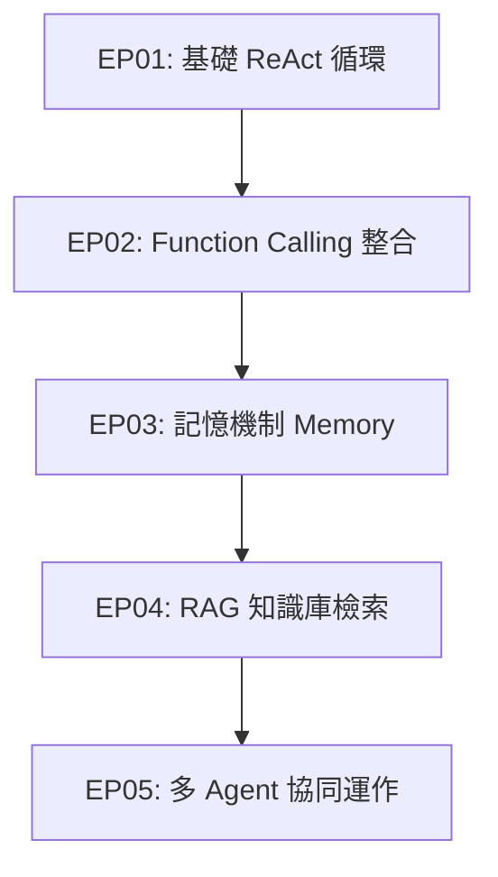

# AI Agent 專案工作藍圖 (Project Blueprint)

本專案旨在透過「動手實作」與「循序漸進」的方式，從零開始理解並學習 AI Agent 的核心概念與設計模式。

---

## 🗺️ 學習與實作路線圖 (Roadmap)



### 📍 Stage 1: 基礎 ReAct (Reasoning & Action) Agent (已完成 ✅)
* **目標**：從零手寫 ReAct 循環，理解 Agent 如何自主思考、選擇工具、觀察結果。
* **關鍵實作**：
  - [x] 設計 System Prompt 讓大模型理解 ReAct 規則 (Thought -> Action -> Observation)
  - [x] 提供自訂 Python 函數作為 Tool (計算機、逐字稿檢索、系統時間)
  - [x] 實作 Agent Loop 控制器，解析模型輸出並調用 Tool
  - [x] 使用彩色終端輸出，視覺化展示思考過程 (`simple_agent.py`)

### 📍 Stage 2: 工具與函數調用 (Function Calling) (已完成 ✅)
* **目標**：從正則表達式解析/純文字 Prompt 轉換成原生的 Function Calling 機制。
* **關鍵實作**：
  - [x] 學習如何將 Python 函數轉換成 API 規範的 JSON Schema
  - [x] 使用 Gemini / Native Function Calling 的工具註冊與觸發
  - [x] 提升工具調用的穩定性與結構化參數解析 (`demo_stage2_function_calling.py`)

### 📍 Stage 3: 記憶與狀態管理 (Memory & State) (已完成 ✅)
* **目標**：讓 Agent 擁有短期記憶（對話歷史）與長期記憶（用戶偏好/外部資料庫）。
* **關鍵實作**：
  - [x] 實作滑動視窗 (Sliding Window) 記憶管理以避免 Token 爆炸
  - [x] 儲存與維護多輪對話 Context 記憶
  - [x] 建立對話 Context 引導推理 (`demo_stage3_memory.py`)

### 📍 Stage 4: 檢索增強生成 (RAG) 整合 (已完成 ✅)
* **目標**：讓 Agent 能查閱外部私有文件 (`Clipping/` 64 篇 YouTube 逐字稿)，回答專業領域問題。
* **關鍵實作**：
  - [x] 逐字稿文件掃描與 Chunk 關鍵字切片
  - [x] 實作 `search_clipping` / `retrieve_knowledge` 檢索工具
  - [x] Context 上下文注入與 AI 知識增廣生成 (`demo_stage4_rag.py`)

### 📍 Stage 5: 多 Agent 協作 (Multi-Agent System) (已完成 ✅)
* **目標**：將複雜任務拆解，讓多個不同角色的 Agent 協同合作完成任務。
* **關鍵實作**：
  - [x] 角色定義 (PlannerAgent, ResearcherAgent, WriterAgent) 與任務分配
  - [x] 實作 Agent 之間的消息傳遞與控制流
  - [x] 合作產出結構化 1 小時體驗課程教案 (`demo_stage5_multi_agent.py`)

---

## 🛠️ 開發環境與專案架構

* **程式語言**：Python 3.10+
* **核心依賴**：
  - `google-generativeai` (使用 Gemini 作為大腦)
  - `python-dotenv` (環境變數管理)
  - `colorama` (終端機彩化)
  - `yt-dlp` (字幕下載)

* **專案目錄架構與檔案說明**：
  - [x] `README.md` - 專案導覽與 Obsidian 三層架構說明
  - [x] `agents.md` - 本工作藍圖
  - [x] `requirements.txt` - 依賴包定義
  - [x] `.env.example` - 增設 API Key 環境變數範本
  - [x] `tools.py` - 自訂工具庫 (計算機、Clipping 逐字稿檢索、系統時間)
  - [x] `simple_agent.py` - Stage 1: ReAct 核心邏輯
  - [x] `demo_stage2_function_calling.py` - Stage 2: 原生 Function Calling 示範
  - [x] `demo_stage3_memory.py` - Stage 3: Memory 記憶管理示範
  - [x] `demo_stage4_rag.py` - Stage 4: Clipping 逐字稿 RAG 檢索示範
  - [x] `demo_stage5_multi_agent.py` - Stage 5: 多 Agent 角色協同示範
  - [x] `run_demo.py` - 統一示範控制台入口

---

## 🚀 執行示範控制台

在終端機執行以下命令即可啟動一鍵互動示範：

```bash
# 啟動互動選單
python run_demo.py

# 或一鍵順序執行全套 5 大 Stage 演練
python run_demo.py A
```
